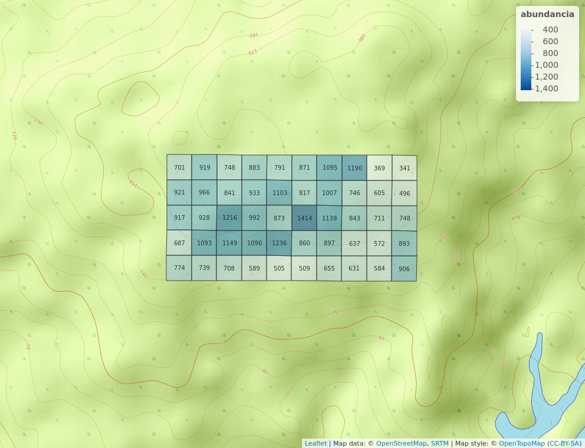
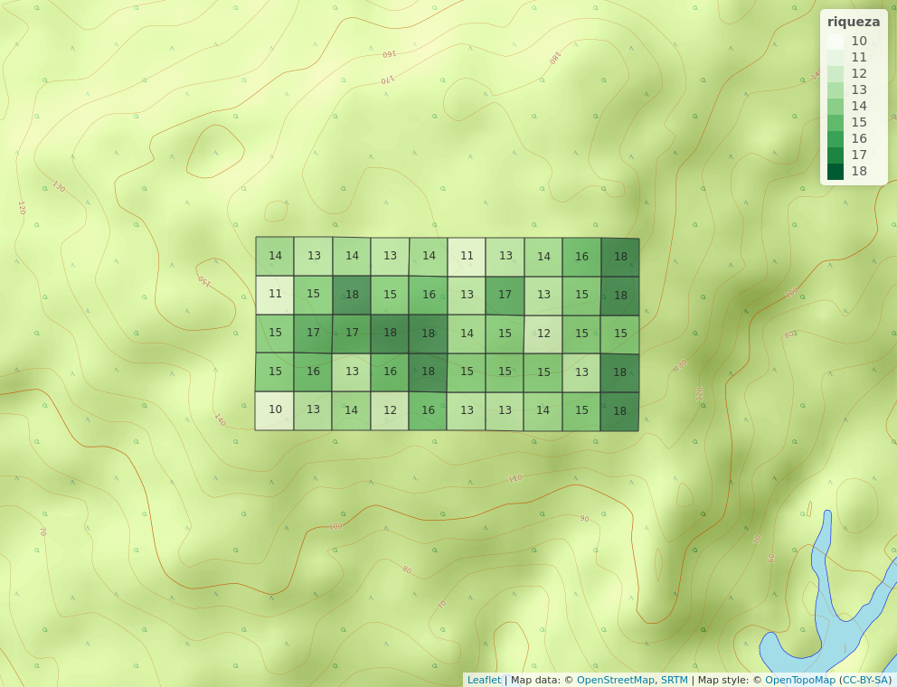
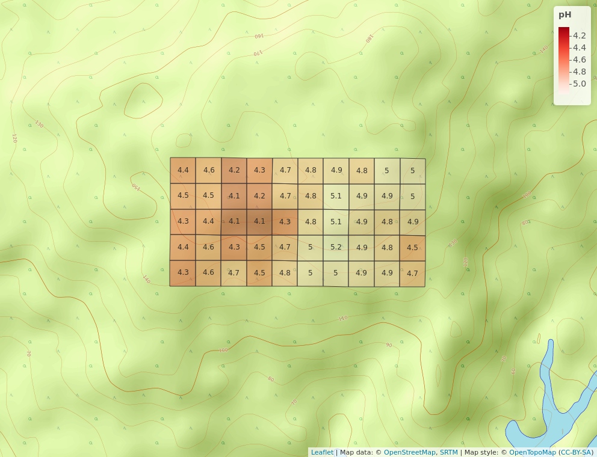

```{r, include=FALSE}
source("aed_Rub.R", local = knitr::knit_global())
```

# Introducción
Las comunidades vegetales de los bosques neotropicales ejemplifican la diversidad y complejidad ecológica de la región tropical. El estudio continuo de la riqueza y la abundancia relativa en estas comunidades permite identificar las especies raras, las cuales son más vulnerables a los cambios en su hábitat y por lo tanto propensas a extinguirse localmente [@Volkov_2003]. Conocer estos aspectos de las comunidades ecológicas y como se encuentran distribuidas en el espacio las especies que las componen, ofrece la oportunidad de comprender como evolucionan en el tiempo y los factores que inciden en su conservación [@moreno2001manual].

La familia Rubiaceae es un importante grupo de plantas vasculares de distribución cosmopolita con una marcada diversidad en regiones tropicales y subtropicales [@davis2009global]. Muchas de las especies que componen esta familia se encuentran adaptadas a la vida en la penúmbra, y prosperan bajo la sombra del dosel selvatico neotropical, región en la cual son especialmente diversas. En estas selvas tropicales, la organización de las comunidades de plantas del sotobosque depende en gran medida de las interacciónes existentes entre las distintas especies que lo habitan [@TORRESLEITE2019151487]. <!-- Cuya riqueza puede ser afectada además por factores ambientales del lugar, ya que algunas de estas especies se encuentran asociadas a rangos elevados de acides y otras condiciones específicas de los componentes del suelo, como la concentración de distintos metales [@article]. --> Es preciso señalar que estudios anteriores realizados en el bosque tropical panameño sobre el grado de reemplazo entre especies de distintas comunidades o diversidad beta, sugieren una tendencia a la disimilaridad entre comunidades en cuanto a su composición, esta aumentando con la distancia en la cual se encuentran separadas en el espacio [@article_condit]. Sin embargo, estos trabajos no restan importancia a la variabilidad del hábitat y se estima su importancia en el estudio de la composición de estos ecosistemas.

<!--Como se estructuran las comunidades ecológicas refiere al número de individuos de cada taxa que las componen[@https://doi.org/10.1111/j.1366-9516.2004.00069.x], además de su distribución en el espacio-->.Si bien es cierto que la distribución de la abundancia de especies depende de características que definen una comunidad en particular, existiendo una proporción variable de especies dominantes, con una abundancia alta en comparación con las especies raras y menos abundantes, las medidas para la distribución de la abundancia relativa se encuentran sujetas a diversas variables las cuales aún no se conocen del todo ni en qué grado inciden en la estructura de la comunidad [@2008arXiv0803.3704N]. <!--Un acercamiento inicial de los datos de abundancia de las distintas especies de Rubiaceae en Barro Colorado \dots arrojó indicios de posibles patrones acerca de su distribución, así como diferentes grados de asociación con las variables ambientales que allí imperan..-->

<!--intro ecologia numerica, contexto, yarayarayara -->
El presente estudio intenta <!--resaltar--> la relación entre abundancia relativa de especies de la familia rubiaceae y su distribución en una porción de bosque húmedo tropical en la parcela permanente Barro Colorado Island (BCI), ubicada en la provincia Colón, Panamá. Los parámetros de riqueza y abundancia relativa obtenidos mediante análisis de datos de los censos realizados en Barro Colorado contribuyen a medir el aporte de la familia rubiaceae a la diversidad de su comunidad. En ese sentido, este trabajo aprovecha la información disponible sobre las características del hábitat en el cual crecen estas poblaciones de plantas [@web_bci] para conocer posibles patrones en la distribución de las especies y como varía la diversidad alpha con respecto a propiedades del terreno y otras condiciones ambientales medibles.

# Metodología
La parcela permanente BCI es una estación de censo permanente administrada por el Instituto Smithsoniano de Investigaciones Tropicales ubicada en el centro de la isla Barro Colorado en la cuenca del canal de Panamá, con las coordenadas 09$^\circ$&nbsp;09'N, 079$^\circ$&nbsp;50'O. Es un polígono de 50 hectáreas cuadradas en el cual se han contabilizado <!--de manera periódica--> todos los arboles con más de 10 mm de diámetro a la altura del pecho cada cinco años desde 1985 [@hubell_foster_1983, @hubell_et_all_1990, @condit_et_al_2012, @condit_et_al_2017]; en este estudio se utilizaron las datos del censo realizado en 2015<!--(dap) [@web_bci]-->.

Los datos referentes a estos censos fueron manejados en R (@cita_r) partiendo de su disposición en dos matrices de comunidad y ambiental de cada uno de los 50 cuadrantes de una hectárea que componen BCI [@jose_ramon_martinez_batlle_2020_4402362]. Estas matrices contienen datos de las variables ambientales como composición química del suelo, tipo de hábitat, geomorfología y edad geomorfológica. Así como datos demográficos y de ubicación espacial de todos los individuos censados.
Se adaptaron *scripts* reproducibles recuperados de @jose_ramon_martinez_batlle_2020_4402362, utilizando la colección de paquetes multifuncionales *Tidyverse*  [@cita_tidyverse], paquetes gráficos y de procesamiento de datos espaciales para la representación de mapas y figuras como `mapview` [@cita_mapview] y *simplefeatures* [@cita_sf]; y herramientas de análisis estadístico como `vegan` [@cita_vegan], `indicspecies` [@cita_indicspecies], entre otros (ver \ref{información suplementaria}).
\dots

Para conocer las características distintivas de los datos conservados en las matrices de comunidad y ambiental, se realizó un análisis exploratorio de los mismos que incluyó un resumen estadístico (media aritmética y mediana) de la riqueza númerica de especies, la abundancia y de las variables ambientales tomadas en BCI. También se realizaron análisis gráficos con el apoyo de tablas, mapas de los cuadrantes y paneles para el análisis de correlación lineal entre variables de ambas matrices, con el fin de obtener una perspectiva general y ayudar a determinar los procedimientos posteriores que se detallan acontinuación \dots


<!--Se utilizaron análisis multivariados utilizando los datos de composición de la comunidad para poner a prueba las hipótesis ecológicas planteadas, uno de ellos fueron--> pruebas de medición de asociación, para lo que se calculó la distancia de Hellinger entre los cuadrantes considerados como objetos. Para esto, fué requerida la transformada de la matríz de comunidad por el método de Hellinger, el cual consiste en la radicación al cuadrado de la abundancia relativa \[ y_{ij}\] como muestra la fórmula \ref{eq:hell_transf}, donde *j* refiere a cada especie o columna en la matríz, *i* es la fila o cuadrante e *i+* representa la suma de filas de la matríz de la i-ésima fila [@legendre_galllagher_2001]<!--(cociente resultante de cada valor de abundancia entre la suma de los sitios)-->. Además, la distancia euclidea entre cuadrantes en cuanto a la presencia de especies fué evaluada aplicando el índice de disimilaridad de Sorensen de la matríz normalizada, con valores de abundancia convertidos en valores binarios.  
\dots
\begin{equation} \label{eq:hell_transf}
y' = \sqrt{\frac{y_{ij}}{y_{i+}}}
\end{equation}
<!--\begin{equation} \label{eq:hell_eqn} 
x_1,x_2 = \sqrt{\sum_{j=1}^{p} \left[ \sqrt{\frac{y_{1j}}{y_{1+}}}  - \sqrt{\frac{y_{2j}}{y_{2+}}}  \right]  ^2}
\end {equation}
-->
\dots
Para conocer la relación de la ocurrencia entre las especies y su distribución en BCI, se utilizó el coeficiente de Spearman para medir el grado de correlación entre las variables riqueza númerica de especies y la abundancia con las variables ambientales geomorfológicas y la composición química del suelo.

# Resultados

\dots
La familia Rubiaceae en Barro Colorado se encuentra representada por 31 especies y 20 generos. El género *Psychotria* presenta la mayor cantidad de especies con 8?. La tabla \ref{tab:abun_sp} indica las abundancias de las especies de toda la comunidad que en total suman 41,838 individuos, con una abundancia media de 65 individuos y mediana ubicada en los 1,350 individuos. El mapa de cuadros de la figura \ref{fig:mapa_cuadros_riq} muestra la riqueza numérica de especies por cuadrante. Los valores de abundancia muestran un aparente patrón en algunos lugares de BCI, al presentar además el valor máximo en riqueza de la familia [ver figura \ref{fig:mapa_cuadros_abun_rubic}].

Los valores para el coeficiente de Spearman de correlación entre rangos no mostraron evidencia de que exista relación entre la riqueza numérica de especies y la abundancia con las variables geomorfológicas notadas en la matríz de variables ambientales. Sin embargo,  el mismo análisis sugiere una posible relación entre la abundancia y la compososición del suelo, mostrando relación positiva con valores altos de Aluminio y Fósforo, así como negativa, para valores altos de pH y concentraciones de otros elementos (B, Ca, Cu, Fe, K, Mg, Mn, Zn y Nitrógeno mineralizado).
#ad


```{r,echo=FALSE}
    knitr::kable(abun_sp,
                 caption = "\\label{tab:abun_sp}Abundancia por especie.")
```

``` {r, echo=FALSE, fig.cap="\\label{fig:abun_sp_q}Número de individuos de cada especie por cuadrante."}
abun_sp_q
```







<!--La figura \ref{fig:mapa_cuadros_ph} presenta la distribución de la variable ácidez del sueloasdasdadaadadadadaddaddasdd.-->



# Discusión

# Agradecimientos

# Información de soporte

\ldots

# *Script* reproducible

\ldots

# Referencias
