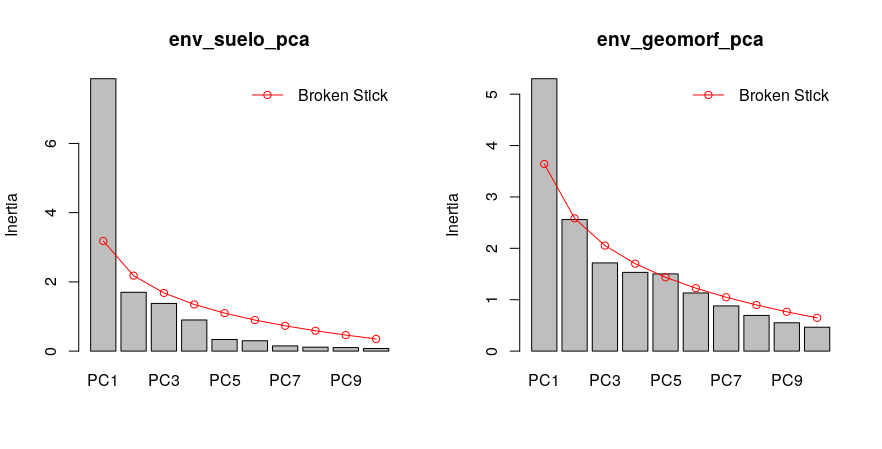
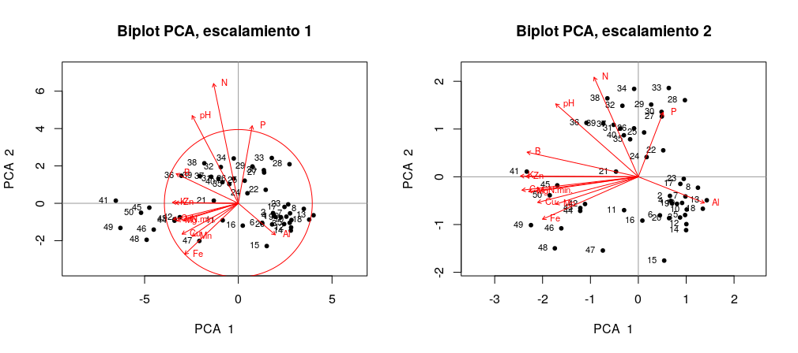
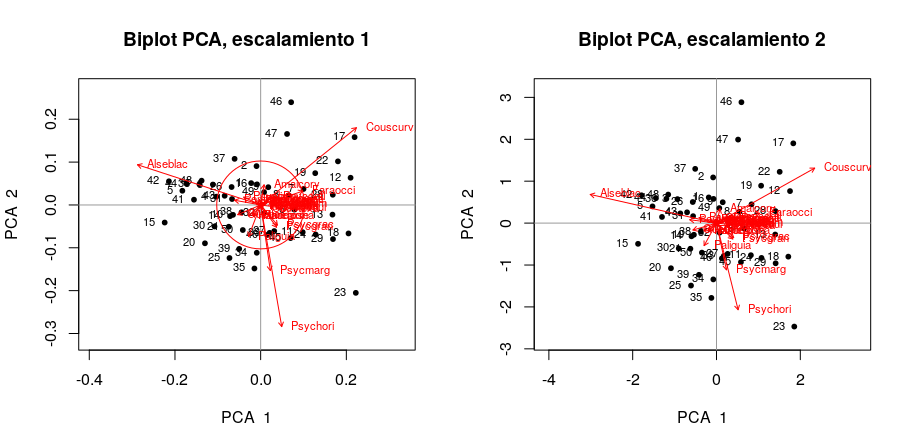
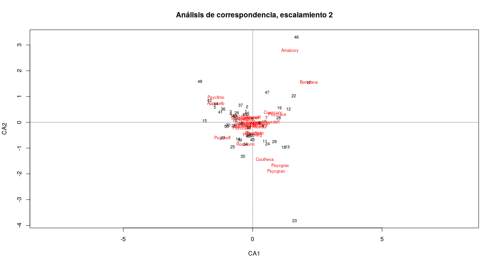
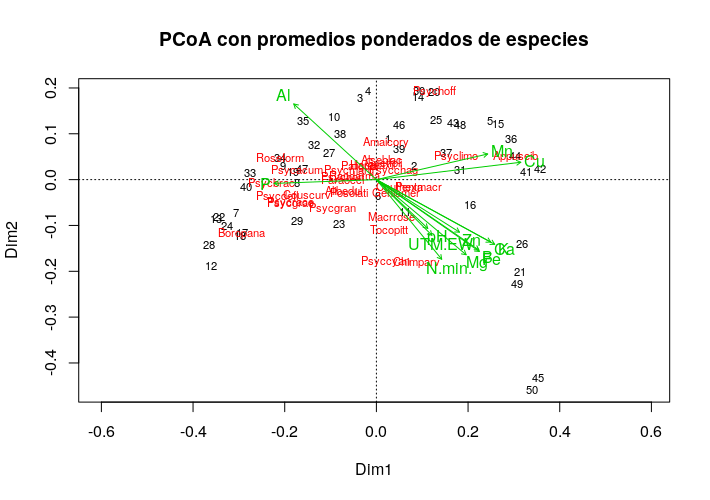
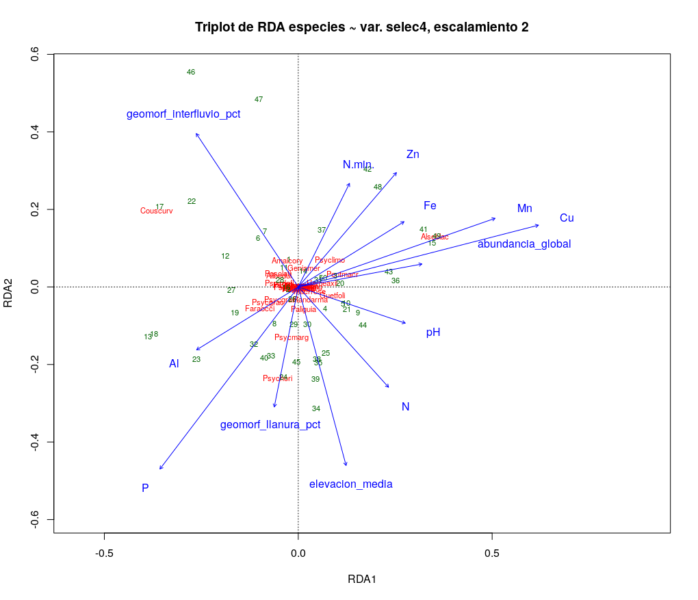
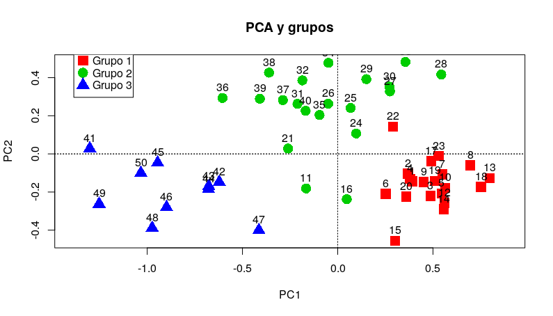

```{r, include=FALSE}
source("aed_Rub.R", local = knitr::knit_global())
```

# Introducción

Las comunidades vegetales de los bosques neotropicales ejemplifican la diversidad y complejidad ecológica de la región tropical. El estudio continuo de su riqueza y abundancia relativa permite identificar las especies raras, las cuales son más vulnerables a los cambios en su hábitat y por lo tanto propensas a extinguirse localmente [@Volkov_2003]. Claramente existe entonces la necesidad de conocer como se encuentran asociadas estas especies entre sí dentro de las comunidades ecológicas para ayudar a comprender los factores que inciden en su conservación [@moreno2001manual].

La familia Rubiaceae es un importante grupo de plantas vasculares de distribución cosmopolita con una marcada diversidad en regiones tropicales y subtropicales [@davis2009global]. Muchas de las especies que componen esta familia se encuentran adaptadas a la vida en la penúmbra, y prosperan bajo la sombra del dosel selvático<!--neotropical, región en la cual son especialmente diversas-->. En estas selvas tropicales, el grado de ordenación y riqueza de las comunidades que componen el sotobosque dependen en gran medida de interacciónes entre las distintas especies [@TORRESLEITE2019151487], además de factores ambientales de su hábitat, ya que muchas de estas especies estan adaptadas a rangos elevados de ácidez y otras condiciones específicas de los componentes del suelo, como la concentración de distintos metales [@article].

Es preciso señalar que trabajos anteriores [@article_condit] sobre el bosque tropical panameño y el grado de reemplazo entre especies de distintas comunidades o diversidad beta, sugieren que la disimilaridad tiende a aumentar en función de la distancia a la cual se encuentran separadas en el espacio. Sin embargo, estos trabajos no restan importancia a la variabilidad del hábitat y se toman en cuenta en este estudio, ya que un acercamiento inicial a los datos de abundancia de las distintas especies de Rubiaceae en Barro Colorado arrojó indicios de posibles patrones acerca de su distribución, y se plantea la posibilidad de que existan especies con algún grado de asociación respecto a las variables ambientales que allí imperan.<!--Saber como se estructuran las comunidades ecológicas puede presentar complicasiones cuando nos enfrentamos a taxónes muy diversos, para los cuales las medidas de abundancia relativa convencionales podrían ver su eficacia limitada [@https://doi.org/10.1111/j.1366-9516.2004.00069.x] refiere al número de individuos de cada taxa que las componen, además de su distribución en el espacio-->

Actualmente, la distribución de la abundancia de las especies se explica por medio de los mecanismos que definen a una comunidad en particular. Pudiendo existir en esta una proporción variable de especies dominantes, relativamente más abundantes en comparación con las especies raras, las medidas para la distribución de la abundancia relativa se encuentran sujetas a interacciones que aún no se conocen del todo ni en qué grado inciden en la estructura de la comunidad [@2008arXiv0803.3704N].

El presente estudio evalúa<!--resaltar--> la relación entre abundancia relativa de especies de la familia Rubiaceae y su distribución en una porción de bosque tropical en la parcela permanente Barro Colorado Island (en lo adelante BCI), Colón, Panamá. Las parcelas permanentes son una excelente fuente de datos demográficos y posibilitan el estudio continuo de la diversidad a nivel local y contribuyen a medir el aporte de la familia Rubiaceae a la diversidad de su comunidad. En ese sentido, este trabajo aprovecha la información disponible [@web_bci] y herramientas de libre acceso [@jose_ramon_martinez_batlle_2020_4402362], para conocer posibles patrones de asociación entre estas especies, y como varía la diversidad con respecto a las características del hábitat en el cual crecen estas poblaciones de plantas y otras condiciones ambientales mediante análisis estadístico de datos de los censos realizados en BCI.

# Metodología

## Ámbito de estudio


La parcela permanente BCI es una estación de censo permanente administrada por el Center for Tropical Forest Science ubicada en el centro de la isla artificial Barro Colorado, con las coordenadas 09$^\circ$&nbsp;09'N, 079$^\circ$&nbsp;50'O. La parcela consiste en un polígono de 50 hectáreas cuadradas en el cual se han contabilizado <!--de manera periódica--> todos los arboles con más de 10 mm de diámetro a la altura del pecho cada cinco años desde 1985 [@hubell_foster_1983; @hubell_et_all_1990; @condit_et_al_2012; @condit_et_al_2017]. En este estudio se utilizaron las datos del censo realizado en el año 2015<!--(dap) [@web_bci]-->.

Los datos referentes a cada uno de los 50 cuadrantes de una hectárea que componen BCI fueron manejados en R [@cita_r], partiendo de su disposición en dos matrices: de comunidad y ambiental  [@jose_ramon_martinez_batlle_2020_4402362]. Estas matrices contienen datos de las variables ambientales, tales como condiciones edáficas, tipo de hábitat, topografía del lugar, clasificación etaria del bosque, y datos demográficos y georeferenciación espacial de todos los individuos censados.
Se adaptaron *scripts* reproducibles recuperados de @jose_ramon_martinez_batlle_2020_4402362, utilizando la colección de paquetes multifuncionales *Tidyverse*  [@cita_tidyverse], paquetes gráficos y de procesamiento de datos espaciales para la representación de mapas y figuras como `mapview` [@cita_mapview] y *simplefeatures* [@cita_sf]; y herramientas de análisis estadístico como `vegan` [@cita_vegan], `indicspecies` [@cita_indicspecies], entre otros (ver \ref{información suplementaria}).

A fin de conocer las características distintivas de los datos conservados en las matrices de comunidad y ambiental, se realizó un análisis exploratorio de los mismos que incluyó <!--resumen estadístico de la riqueza númerica de especies, la abundancia y de las variables ambientales tomadas en BCI. También se realizaron-->la visualización de gráficos, tablas, mapas de los cuadrantes de una hectárea y paneles de correlación lineal entre variables de ambas matrices, esto permitió obtener una perspectiva general y ayudó a determinar los procedimientos posteriores que se detallan acontinuación.

##Medición de asociación

<!--Se realizó análisis multivariado de los datos de composición de la comunidad para poner a prueba las hipótesis ecológicas planteadas, uno de ellos fueron-->Para las pruebas de medición de asociación, se calculó la distancia euclídea entre los cuadrantes considerados como objetos. Para esto, fué requerida la transformada de la matríz de comunidad por el método de Hellinger, el cual consiste en la radicación al cuadrado de la abundancia relativa $y_{ij}$ (cociente resultante de cada valor de abundancia entre la suma de los sitios) como muestra la fórmula \ref{eq:hell_transf}. Donde *j* refiere a cada especie o columna en la matríz, *i* es la fila o cuadrante e *i+* representa la suma de filas de la matríz de la i-ésima fila [@legendre_galllagher_2001]. Además, la distancia euclídea entre cuadrantes en cuanto a la ocurrencia de especies fué evaluada aplicando el índice de disimilaridad de Jaccard de la matríz normalizada, con valores de abundancia convertidos en valores binarios [@borcard_legendre]. De la misma manera, se utiliza la métrica de Jaccard aplicada a la matriz de comunidad transpuesta y convertida a datos de presencia/ausencia para medir el grado de asociación entre especies.
\begin{equation} \label{eq:hell_transf}
y' = \sqrt{\frac{y_{ij}}{y_{i+}}}
\end{equation}
<!--\begin{equation} \label{eq:hell_eqn} 
x_1,x_2 = \sqrt{\sum_{j=1}^{p} \left[ \sqrt{\frac{y_{1j}}{y_{1+}}}  - \sqrt{\frac{y_{2j}}{y_{2+}}}  \right]  ^2}
\end {equation}
-->
Para poder comparar la relación entre las especies según su abundancia númerica, se utilizó estandarización *ji*-cuadrado de la matríz de comunidad transpuesta [@legendre_galllagher_2001]. La ocurrencia entre las especies y su distribución en BCI fué examinada por medio de el coeficiente de correlación entre rangos de Spearman para medir el grado de asosiación entre las variables riqueza númerica de especies y la abundancia con las variables ambientales geomorfológicas y la composición química del suelo [@borcard_legendre].

#Análisis de agrupamiento

Tanto el método jerarquico aglomerativo de asociación entre pares de cuadrantes (según su composición de especies) bajo el criterio de enlace completo y el método Ward basado en la varianza mínima, fueron utilizados en un acercamiento preliminar al análisis de agrupamiento para contrastar su eficacia y lograr conseguir grupos consistentes entre ambos [@borcard_legendre]. Estos generaron dendrogramas que posteriormente fueron examinados en paralelo con la matríz de distancias de cuerdas [@legendre_galllagher_2001] utilizando correlación cofenética entre ambos para determinar el número ideal de grupos.
Se hizo uso de los métodos de remuestreo bootstrap y boostrap multiescalar para conocer la probabilidad de éxito en la inferencia del número de grupos y la identidad de sus componentes [@borcard_legendre]. Las reparticiones se basaron en una probabilidad de 91% o más de acierto para el método bootstrap y de un 95% para boostrap multiescalar. Estos resultados sugieren 2 grupos con 95% o más de confianza en cada caso para el metodo Ward; 12 grupos sugeridos por los estandares establecidos para bootstrap y 10 grupos para bootstrap multiescalar para el método por medio de enlace completo.
Para cada método de agrupamiento se consideraron como válidos: un grupo con 34 cuadrantes y un segundo conformado por 16 formulados por el método Ward, y dos grupos por enlace completo que incluyen 20 y 30 sitios.
<!--En cuanto a las anchuras de silueta promedio, en el método Ward el programa sugirió 2 grupos presentes, 2 para complete y 2 con un posible 3 para upgma. Fué utilizado un mapa de calor para cada método con el fin de analizar de manera visual las distancias entre sitios y compararlas con los analisis estadisticos. 
Los análisis de agrupamiento posteriores realizados en este trabajo se basaron en los métodos Ward y por enlace completo. La decisión se justifica al encontrarse patrones consistentes en la composición y número de grupos en ambos métodos. Los valores de correlación cofenética para el método Ward (0.657) tuvieron una diferencia absoluta menor al compararles con el método por enlace completo (0.615) que con el método upgma (0.723).-->  <!--otra vaina es que bootstrap y el corte del árbol basado en la altura para upgma dejaban pila de grupos afuera y eso no ta de na -->
 
<!--Pruebas T de Student y ? Wilcoxon homogeneizan las medias y medianas de las variables ambientales en los grupos identificados, con lo que se busca determinar cuales valores podrían ser responsables(asociados) a la diferenciación en la composición de ambos grupos.-->

Se utiliza la métrica del valor indicador o "IndVal" [@dufrene_legendre] para conocer las especies que pudieran ser consideradas características de cada grupo por medio de permutaciones aleatorias de los sitios según la ocurrencia de las especies y su abundancia. Así mismo, se estudia el grado de asociación de las especies con cierta preferencia por las combinaciones de cuadrantes consideradas como grupos, indicado por el coeficiente de correlación biserial puntual [@borcard_legendre].
Se llevó acabo un acercamiento parecido al anterior durante las pruebas estadisticas de la hipotesis nula, sobre la base de que las especies que se encontraban en cuadrantes pertenecientes a un determinado grupo lo hacían por obra del azar. Esta prueba se logró mediante reordenación aleatoria de los valores de abundancia y comparando su distribución con los valores obtenidos anteriormente [@caceres2009associations]. Para estas pruebas de asociación y las subsiguientes se declaro un valor de significancia *P* = 0.05.

# Ordenación

Las carasteristicas de la varianza en los datos ambientales en BCI fueron estudiados mediante análisis de sus componentes principales (PCA) [@borcard_legendre]. Este método permitió resumir la multidimensionalidad de las variables, explicar la varianza y los posibles patrones que estos podrían seguir. Esto se realizó también para la matríz de comunidad, con valores de abundancia normalizados por la transformada Hellinger, además de un análisis de correspondencia (CA) de la misma matríz.<!--\ref{fig:grafico_pca_suelo}se observan los cuadrantes agrupados por el método jerarquico UPGMA? y presentados sobre las escalas de varianza relativas del primer y segundo componentes principales.--> De manera alternativa, se realiza un análisis de las coordenadas principales (PCoA) para ayudar a conocer la relación entre las especies, utilizando el coeficiente de disimilaridad de Jaccard como medida, y a su vez usando los promedios ponderados por los valores de abundancia para permitir su representación en los diagramas *biplot* [@borcard_legendre].

Se realizó un acercamiento restringido de la ordenación para probar el grado de dependencia de los datos de la matríz de comunidad con la matríz ambiental, mediante ajuste lineal en un análisis de redundancia (RDA) [@borcard_legendre], utilizando la matríz de comunidad transformada por Hellinger. Se seleccionaron las variables que presentaron cierto grado de asociación, y (a discreción y de manera secuencial) se excluyeron algunas de estas, con el objetivo de reducir el grado de colinealidad entre las variables independientes restantes.

Puntuaciones de las variables sitios con promedios ponderados de los resultados de RDA y datos de abundancia

# Análisis de la diversidad

Con la finalidad de asignar medidas apropiadas a la diversidad de especies de la familia Rubiaceae en BCI, se recurre a la aplicación de los índices, números, ratio¿. Además, se examina la correlación de Pearson entre estas medidas y las variables ambientales que aparentaron tener algun efecto en la riqueza de especies y la equidad.  y método de rarefacción con el cual se obtuvo el valor esperado de riqueza en base al número de individuos del cuadrante con la menor abundancia... 


<!--Para probar la relación existente entre los cuandrantes en los grupos generados por Complete y las variables de suelo, se posicionaron la relación entre los resultados del PCA-->


# Resultados

La familia Rubiaceae en Barro Colorado se encuentra representada por 31 especies y 20 generos. El género *Psychotria* presenta la mayor cantidad de especies (8). La tabla \ref{tab:abun_sp} indica las abundancias de las especies de toda la comunidad que en total suman 41,838 individuos, con una abundancia media de 65 individuos y mediana ubicada en los 1,350 individuos. El mapa de cuadros de la figura \ref{fig:abun_sp_q} contiene la riqueza numérica de especies por cuadrante. Los valores de abundancia muestran un aparente patrón en la parte centro-occidental de BCI, en donde además se encuentran los sitios con la mayor abundancia de la familia [ver figura \ref{fig:mapa_cuadros_abun_rubic}].<!--Las pruebas de asociación entre la abundancia numérica de las distintas especies arrojaron 20 combinaciones de especies con asociación positiva-->


```{r,echo=FALSE}
    knitr::kable(abun_sp,
                 caption = "\\label{tab:abun_sp}Abundancia por especie.")
```


``` {r, echo=FALSE, fig.cap="\\label{fig:abun_sp_q}Número de individuos de cada especie por cuadrante."}
abun_sp_q
```


Los valores para el coeficiente de Spearman presentados en el panel de correlación de la figura \ref{fig:panel_cor_suelo_abun_riq_rubic} no mostraron evidencia de que exista relación entre la riqueza numérica de especies y la abundancia con las variables geomorfológicas notadas en la matríz de variables ambientales. Sin embargo, el mismo análisis sugiere una posible relación entre la abundancia numérica de especies y la compososición del suelo, mostrando relación positiva con valores altos de Aluminio y Fósforo. Así como negativa, para valores altos de pH y concentraciones de otros elementos<!--(B, Ca, Cu, Fe, K, Mg, Mn, Zn y Nitrógeno mineralizado)-->.


<!--La figura \ref{fig:mapa_cuadros_ph} presenta la distribución de la ácidez en el suelo de BCI.-->Las variables fósforo y cobre obtuvieron valores de *P* 0.0000347 y 0.0127 "significativos" en las pruebas de correlación respecto a los grupos 1 y 2 formulados por complete.<!--fueron 0.0000347 y 0.000408 para wilcoxon(significativos). Para la de variables asociadas a la diferenciacion de los grupos fuevariable *Cu* fueron 0.0127 student y 0.0333 wilx. Otro valor de *P* algo "menos significativo" fue 0.0808, correspondiente a la abundancia de toda la comunidad.(0.0808 T, 0.0685 W); *Al* (0.0867 W); riqueza global (0.0314W)--> De manera similar, para los grupos producidos mediante Ward el valor *P* para la variable fósforo fue de 0.000370 y 0.00726 para cobre. Otros valores para otras variables fueron: 0.0341 (Manganeso), 0.0454 (hierro), 0.0243 y 0.0331 (riqueza y abundancia de todas las familias en BCI).<!--para student y 0.0129 para wilcoxon. Para *Cu*cobre fue 0.00726 sTdnt y 0.0115 Wilcx. valores casi significativos: riqueza global(0.0243 T, 0.0115 W);abundancia global(0.0331 T, 0.0375 W); *Mn*(0.0341 T, 0.0405 W); *Fe*(0.0454 T, 0.0688 W); *Ca* (0.0789 W)nivel de significancia p=0.01(significtv), y 0.1(casi significtv)-->
<!--En complete, el grupo 1 (verde) pareciera asociarse con el cobre y el grupo 2 (gris) con el fósforo. Los sitios de ambos grupos son comparables con los mapas de concentración de P y Cu del aed_6 y parecen coincidir.
Para Ward pasa algo muy parecido, solo que los colores de los grupos están invertidos 2(verde) y 1(gris).-->

Las especies *Alseis blackiana* y *Psychotria limonensis* fueron las que obtuvieron un valor alto de confianza al examinar su potencial como especies indicadoras del grupo 1 (grupo 2 en Ward). Para el caso del grupo 2 (1 en Ward), las especies indicadoras fueron *Faramea occidentalis*, *Psychotria horizontalis* y *Coussarea curvigemmia*<!--esta ultima másomenos-->.
La ocurrencia de *A. blackiana* y *Pentagonia macrophylla* indica su preferencia por el grupo 1 (complete). Por otra parte, en el grupo 2 (complete) siete especies resultan de interes por su ocurrencia: la muy dominante *F. occidentalis*; *Psychotria deflexa*, *P. racemosa*, *P. horizontalis*, *Posoqueria latifolia*, *Alibertia edulis* y *Coussarea curvigemmia*. En los grupos generados mediante Ward solo *F. occidentalis*, *P. horizontalis* y *A. blackiana* resultaron compatibles en las pruebas de fidelidad de asociación.

# PCA

En la figura \ref{fig:pca_biplot_suelo}, se aprecian tres grupos de cuadrantes en el recuadro rotulado como escalamiento 1 de los diagramas *Biplot* generados en el PCA de las variables de suelo, en el cual además, se observa que las variables Nitrógeno, Fósforo y pH aportan la mayor parte de la varianza. La relación entre estas variables se encuentra debidamente representada en el recuadro del escalamiento 2, por medio de los ángulos que forman sus vectores. En el caso de las variables geomorfológicas, algunos sitios están asociados a un alto porcentaje de llanura y hombrera, aunque la mayoría se encuentra más cerca del origen formado por los ejes de los componentes principales 1 y 2 (ver figura \ref{fig:pca_biplot_geomorf}).

Los gráficos de barras de la figura \ref{fig:pca_suelo_geomorf_br_stick} muestran los componentes principales de la varianza en las variables de suelo y geomorfológia de BCI. La varianza acumulada de los PC1 y PC2 logran explicar el 73.1% y el 43.6% de la varianza total respectivamente. En estos gráficos se incluye el comportamiento predecido por el modelo de bara quebrada, representado por la línea roja formando la curva.


Los resultados del PCA de los datos de la matríz de comunidad se encuentran resumidos en los diagramas de la figura \ref{fig:pca_biplot_sps}. El escalamiento 1, muestra muchos de los cuadrantes dispuestos alrededor del origen formado por los ejes, además de unos cuantos cuadrantes atípicos y más alejados. Por otro lado, las especies *A. blackiana*, *C. curvigemmia*, *P. marginalis* y *P. horizontalis*, presentan una contribución desproporcionada a la varianza total, en comparación con el resto de las especies.


# CA Esto puede ser interezante, discutir


La varianza explicada por los componentes principales 1 y 2 en el CA para las especies *Psychotria graciliflora* y *Psychotria grandis* se muestran aparentemente asociadas en el escalamiento 2 de la figura \ref{fig:biplot_correspndncia_sps_escal_2}.<!--Sus respectivas abundancias dentro de la comunidad también tienen valores comparables (65, 57).--> Además, se observa que casi todas las especies se encuentran próximas al punto de intersección, salvo aquellas que presentaron una abundancia reducida, las cuales aparecen asociadas a pequeños grupos de cuadrantes sin un patrón evidente. La disparidad en la incidencia de las especies podría estar reflejandose con su disposición en el diagrama. No obstante, estos resultados no coinciden con los arrojados por el PCA de la matríz de distancias Hellinger (Fig. \ref{fig:pca_biplot_sps}).


# PCoA

Los resultados del análisis de coordenadas principales mostrado en la fig. \ref{fig:pcoa_sps_jacc_var_ambient} contienen la relación entre las especies y los cuadrantes por medio de las distancias de Jaccard. En el *biplot* se incluye, además, los vectores de las variables ambientales, en los que se observa asociación entre el contenido de cobre, manganeso y fósforo con algunos sitios y especies. También, algunas especies se presentan aparentemente asociadas entre sí, como también a algunos cuadrantes. Aunque otra vez, es probable que la aparente asociación aparezca debido a la combinación de una incidencia restringida por parte de estas especies y al grado de autocorrelación entre los cuadrantes.

# RDA

En cuanto a los *triplots* generados por RDA mostrados en la figura \ref{fig:rda_triplot_var_selec_4_escal2} se destacan los  la distancia euclídea conservada entre las especies. Estas últimas se disponen en forma de abanico¿ algunas resultan aberraciones, muy alejadas del punto de intercepto, sitios emjambrados en el origen y las especies en dispuestas en forma de abanico a su alrededor. Esto indica poca asociación entre las especies, no se encuentra un patrón evidente entre la mayoría.
Se destaca un grupo de cuadrantes en los cuales *Psychotria horizontalis* y *Psychotria marginata* se encuentran asociadas. Al parecer, este grupo de cuadrantes constituye un microhabitat encontrado sobre una pequeña meseta en la parte nor-oriental de BCI, y se diferencia además por una alta concentración de fósforo y aluminio en el suelo. La especie *Alseis blackiana* presenta asociación con el contenido de metales como  manganeso, hierro y cobre en el suelo, esto coincide con los resultados del PCA, y podría ser considerada como una especie indicadora de estas condiciones ambientales.

# Diversidad

La riqueza de la familia aumenta con el hierro, así tambien la equidad. Además, parece que la riqueza aumenta en los suelos con un alto contenido de nitrógeno en el suelo y en su forma mineralizada. La equidad también es mayor hacia el norte de bci.

<Poner aquí curva rarefaccion leyenda: Gráfico con curva de acumulación de especies. Las barras horizontales muestran el valor de riqueza estimado en cada sitio para un esfuerzo de muestreo equivalente a 341 individuos (abundancia en el cuadrante 50).>


<!--Excluir el potasio modificó la relación entre el aluminio y el pH....... comentar.-->

El grupo 2 (1 en Ward) contiene los sitios con tendencia a presentar valores altos de acidez [\ref{fig:mapa_cuadros_ph}] y concentración de aluminio.<!--Indicios de esto pudieron observarse en los valores del indice de correlación de Spearman el cual indicaba una relación significativa? de la abundancia con la ácidez y el pH.-->
















# Discusión

<!--Las variables cobre y fósforo en el suelo producieron una diferenciación entre los grupos determinados.-->La determinación de las especies indicadoras *Faramea occidentalis* y *Alseis blackiana* de los grupos uno y dos podría estár asociada a la evidente dominancia que presentan estas especies en la comunidad de rubiaceas. Especialmente *F. occidentalis*, cuya abundancia alcanza valores extremos dentro de todo BCI e incluso podría estar inclinando los resultados de estos analisis?. Esto se vuelve razonable al tomarse en cuenta el hecho de que muchas especies se presentaban con pocos valores de abundancia, varias incluso representadas por un solo individuo.
Las especies con preferencia por el grupo 1 evaden sistemáticamente al grupo 2 y viceversa. Esta diferenciación en la ocurrencia de las especies no se explica del todo con las variables ambientales medidas en BCI y es posible que exista algun otro factor que determina la ordenación de esta comunidad de plantas. La cobertura del dosel arbóreo podría ser una de estas variables a considerarse, puesto que las especies dominantes en la comunidad son a la vez tolerantes a la sombra (@grandtner2013dictionary).
<!--Los análisis de asociación realizados indicaban que el contenido de aluminio y la acidez del suelo pareciera estar caracterizando la incidencia de la familia Rubiaceae frente a otras especies de plantas.El índice de correlación de Spearman indicaba--> la relación entre la abundancia de la familia y el contenido de alumínio y fósforo. Esto coincidió con los análisis de la varianza explicada entre variables, aunque solo para la concentración de fósforo. Adicionalmente, la comunidad de rubiaceas pareciera poder dividirse en dos grupos relativamente bien diferenciados entre sí por sus diferencias en el contenido de *Cu* y *P* del suelo. <!--Otros trabajos anteriores se han referido a la tolerancia de esta familia hacia los metales pesados()-->. Es probable que las especies indicadoras del grupo con un mayor contenido de cobre estén mostrando preferencia por estas condiciones ambientales. Sin embargo, el pH y la mayoría de componentes del suele en BCI tienen valores bastante homogéneos y más bien se presentan pequeños gradientes entre algunos lugares, lo cual evita que este tipo de acercamiento sea concluyente.
  
<!--El grado de asociación presente entre cuadrantes medido utilizando el indice de disimilaridad de Jaccard arrojó distintos valores para el grado de exclusividad entre sitios. Se encontró que estos valores eran más altos para los lugares más alejados entre sí, presentaban una media alta, además de valores extremos a lo largo de las observaciones en la serie-->
Los análisis de agrupamiento pueden verse sesgados por la heterogeneidad morfométrica que pueden presentar las plantas de esta familia. Estas especies presentan diversos hábitos de crecimiento, desde porte herbáceo y arbustivo a árboles relativamente grandes. Esto hace que el hecho de que se incluya el criterio de dap de 10 mm en el momento de ser censadas podría estar excluyendo especies clave en el rompecabezas.

<!--
-->

# Agradecimientos

# Información de soporte


\ldots

# *Script* reproducible

\ldots

# Referencias
