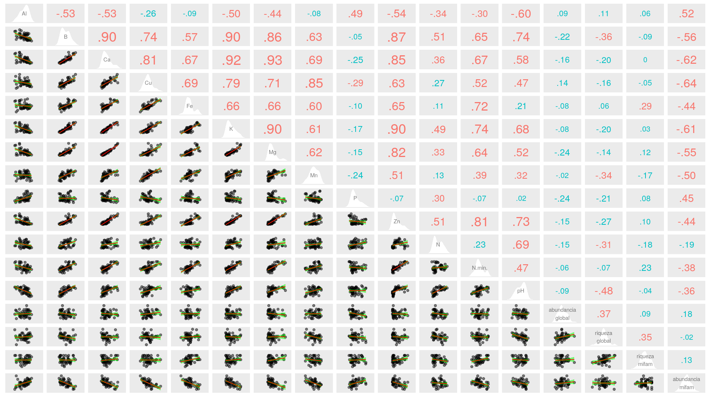
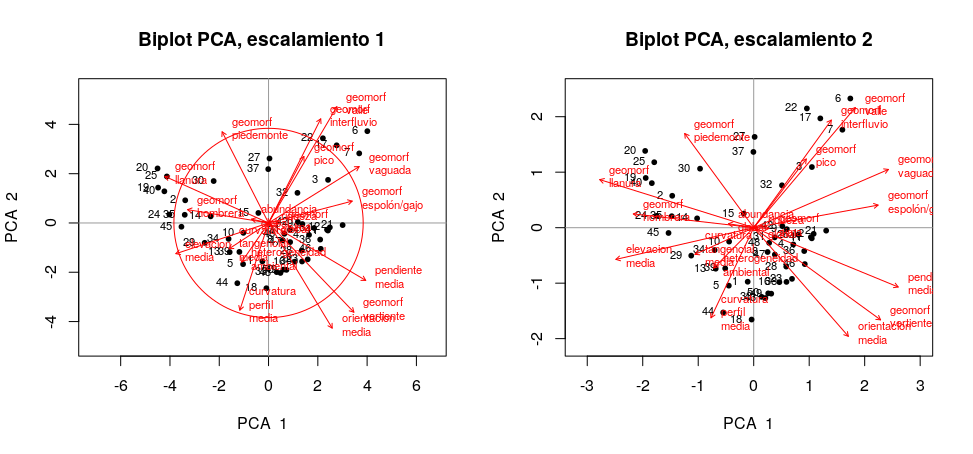

```{r, include=FALSE}
source("aed_Rub.R", local = knitr::knit_global())
```

# Introducción

Las comunidades vegetales de los bosques neotropicales ejemplifican la diversidad y complejidad ecológica de la región tropical. El estudio continuo de su riqueza y abundancia relativa permite identificar las especies raras, las cuales son más vulnerables a los cambios en su hábitat y por lo tanto propensas a extinguirse localmente [@Volkov_2003]. Adicionalmente, monitorear la diversidad como propiedad de las comunidades vivientes resulta de suma importancia para analizar el efecto que tiene la transformación de los ecosistemas en las comunidades naturales. Claramente existe entonces la necesidad de conocer como se encuentran asociadas las especies entre sí dentro de las comunidades ecológicas para ayudar a comprender los factores que inciden en su conservación [@moreno2001manual].

La familia Rubiaceae es un importante grupo de plantas vasculares de distribución cosmopolita con una marcada diversidad en regiones tropicales y subtropicales [@davis2009global]. Muchas de las especies que componen esta familia se encuentran adaptadas a la vida en la penúmbra, y prosperan bajo la sombra del dosel selvático<!--neotropical, región en la cual son especialmente diversas-->. En estas selvas tropicales, el grado de ordenación y riqueza de las comunidades que componen el sotobosque dependen en gran medida de interacciónes entre las distintas especies [@TORRESLEITE2019151487], además de factores ambientales de su hábitat, ya que muchas de estas especies estan adaptadas a rangos elevados de ácidez y otras condiciones específicas de los componentes del suelo, como la concentración de distintos metales [@article].

Es preciso señalar que trabajos anteriores [@article_condit] sobre el bosque tropical panameño y el grado de reemplazo entre especies de distintas comunidades o diversidad beta, sugieren que la disimilaridad tiende a aumentar en función de la distancia a la cual se encuentran separadas en el espacio. Sin embargo, estos trabajos no restan importancia a la variabilidad del hábitat y se toman en cuenta en este estudio, ya que un acercamiento inicial a los datos de abundancia de las distintas especies de Rubiaceae en Barro Colorado arrojó indicios de posibles patrones acerca de su distribución, y se plantea la posibilidad de que existan especies con algún grado de asociación respecto a las variables ambientales que allí imperan.

Aunque la distribución de la abundancia de las especies actualmente es en buena parte atribuida a los mecanismos que definen a una comunidad en particular, como la prevalencia de especies dominantes, relativamente más abundantes en comparación con las especies raras. Las medidas para la distribución de la abundancia relativa se encuentran sujetas a interacciones que aún no se conocen del todo, ni en qué grado inciden en la estructura de la comunidad [@2008arXiv0803.3704N].

El presente estudio evalúa<!--resaltar--> la relación entre abundancia relativa de especies de la familia Rubiaceae y su distribución en una porción de bosque tropical en la parcela permanente Barro Colorado Island (en lo adelante BCI), Colón, Panamá. Las parcelas permanentes, como BCI, son una excelente fuente de datos demográficos y posibilitan el estudio continuo de la diversidad a nivel local y contribuyen a medir el aporte de la familia Rubiaceae a la diversidad de su comunidad. En ese sentido, este trabajo aprovecha la información disponible [@web_bci], y herramientas de libre acceso [@jose_ramon_martinez_batlle_2020_4402362], para conocer posibles patrones de asociación entre estas especies, como varía la diversidad con respecto a las características del hábitat en el cual crecen estas poblaciones de plantas, y otras condiciones ambientales mediante análisis estadístico de datos de los censos realizados en BCI.

# Metodología

##Ámbito de estudio


BCI es una estación de censo permanente administrada por el Center for Tropical Forest Science ubicada en el centro de la isla artificial Barro Colorado, con las coordenadas 09$^\circ$&nbsp;09'N, 079$^\circ$&nbsp;50'O. La parcela consiste en un polígono de 50 hectáreas cuadradas en el cual se han contabilizado <!--de manera periódica--> todos los arboles con más de 10 mm de diámetro a la altura del pecho cada cinco años desde 1985 [@hubell_foster_1983; @hubell_et_all_1990; @condit_et_al_2012; @condit_et_al_2017]. En este estudio se utilizaron las datos del censo realizado en el año 2015<!--(dap) [@web_bci]-->.

Los datos referentes a cada uno de los 50 cuadrantes de una hectárea que componen BCI, fueron manejados en R [@cita_r], partiendo de su disposición en dos matrices: de comunidad y ambiental  [@jose_ramon_martinez_batlle_2020_4402362]. Estas matrices contienen datos de las variables ambientales, tales como condiciones edáficas, tipo de hábitat, topografía del lugar, clasificación etaria del bosque, y datos demográficos y georeferenciación espacial de todos los individuos censados.
Se adaptaron *scripts* reproducibles recuperados de @jose_ramon_martinez_batlle_2020_4402362, utilizando la colección de paquetes multifuncionales `Tidyverse`  [@cita_tidyverse], paquetes gráficos y de procesamiento de datos espaciales para la representación de mapas y figuras como `mapview` [@cita_mapview] y `simplefeatures` [@cita_sf]; y herramientas de análisis estadístico, como `vegan` [@cita_vegan], `indicspecies` [@cita_indicspecies], entre otros (ver información suplementaria: \ref{inf_supletary}).

A fin de conocer las características distintivas de los datos conservados en las matrices de comunidad y ambiental, se realizó un análisis exploratorio de los mismos que incluyó <!--resumen estadístico de la riqueza númerica de especies, la abundancia y de las variables ambientales tomadas en BCI. También se realizaron-->la visualización de gráficos, tablas, mapas de los cuadrantes de una hectárea y paneles de correlación lineal entre variables de ambas matrices, esto permitió obtener una perspectiva general y ayudó a determinar los procedimientos posteriores que se detallan acontinuación.

##Medición de asociación

<!--Se realizó análisis multivariado de los datos de composición de la comunidad para poner a prueba las hipótesis ecológicas planteadas, uno de ellos fueron-->Para las pruebas de medición de asociación, se calculó la distancia euclídea entre los cuadrantes considerados como objetos. Para esto, fue requerida la transformada de la matriz de comunidad por el método de Hellinger, el cual consiste en la radicación al cuadrado de la abundancia relativa $y_{ij}$ (cociente resultante de cada valor de abundancia entre la suma de los sitios) como muestra la fórmula \ref{eq:hell_transf}. Donde *j* refiere a cada especie o columna en la matriz, *i* es la fila o cuadrante e *i+* representa la suma de filas de la matriz de la i-ésima fila [@legendre_galllagher_2001]. Además, la distancia euclídea entre cuadrantes en cuanto a la ocurrencia de especies fue evaluada aplicando el índice de disimilaridad de Jaccard de la matriz normalizada, con valores de abundancia convertidos en valores binarios [@borcard_legendre]. De la misma manera, se utiliza la métrica de Jaccard aplicada a la matriz de comunidad transpuesta y convertida a datos de presencia/ausencia para medir el grado de asociación entre especies.
\begin{equation} \label{eq:hell_transf}
y' = \sqrt{\frac{y_{ij}}{y_{i+}}}
\end{equation}
<!--\begin{equation} \label{eq:hell_eqn} 
x_1,x_2 = \sqrt{\sum_{j=1}^{p} \left[ \sqrt{\frac{y_{1j}}{y_{1+}}}  - \sqrt{\frac{y_{2j}}{y_{2+}}}  \right]  ^2}
\end {equation}
-->
Para poder comparar la relación entre las especies según su abundancia númerica, se utilizó estandarización *ji*-cuadrado de la matriz de comunidad transpuesta [@legendre_galllagher_2001]. La ocurrencia entre las especies y su distribución en BCI fue examinada por medio de el coeficiente de correlación entre rangos de Spearman para medir el grado de asosiación entre las variables riqueza númerica de especies y la abundancia con las variables ambientales geomorfológicas y la composición química del suelo [@borcard_legendre].

##Análisis de agrupamiento

Tanto el método jerarquico aglomerativo de asociación entre pares de cuadrantes (según la composición de especies) bajo el criterio de enlace completo, y el método Ward basado en la varianza mínima, fueron utilizados en un acercamiento preliminar al análisis de agrupamiento para contrastar su eficacia en conseguir grupos consistentes y con significado ecológico [@borcard_legendre]. Estos generaron dendrogramas que posteriormente son comparados con la matriz de distancia de cuerdas [@legendre_galllagher_2001], utilizando correlación cofenética entre ambos para determinar el número ideal de grupos. Además, se utilizó remuestreo bootstrap y boostrap multiescalar para conocer la probabilidad de éxito en la inferencia del número de grupos y la identidad de sus componentes [@borcard_legendre]. Las reparticiones se basaron en una probabilidad de 91% o más de acierto para el método bootstrap y de un 95% para boostrap multiescalar.

Puesto que se encontraron patrones consistentes en la composición y número de grupos entre los métodos examinados (ver figura \ref{fig:grupos_ward_complete_altura_corte2}), los análisis de agrupamiento posteriores se basaron en los producidos mediante enlace completo, para el cual se consideraron dos grupos compuestos por 20 y 30 cuadrantes, respectivamente.

Para conocer cuales especies son características o se encuentran asociadas a cada grupo, se utiliza la métrica del "valor indicador" o IndVal [@dufrene_legendre], la cual está basada en permutaciones aleatorias de los sitios según la ocurrencia de las especies y su abundancia. Así mismo, se estudia el grado de asociación de las especies con cierta preferencia por las combinaciones de cuadrantes consideradas como grupos, indicado por el coeficiente de correlación biserial puntual [@borcard_legendre].
Se llevó acabo un acercamiento parecido al anterior durante las pruebas estadisticas de la hipotesis nula, sobre la base de que las especies que se encontraban en cuadrantes pertenecientes a un determinado grupo lo hacían por obra del azar. Esta prueba se logró mediante reordenación aleatoria de los valores de abundancia y comparando su distribución con los valores obtenidos anteriormente [@caceres2009associations]. Para estas pruebas de asociación y las subsiguientes se utilizó un nivel de significancia $\alpha = 0.05$.<!--
Estos resultados sugieren 2 grupos con 95% o más de confianza en cada caso para el metodo Ward; 12 grupos sugeridos por los estandares establecidos para bootstrap y 10 grupos para bootstrap multiescalar para el método por medio de enlace completo.--><!--un grupo con 34 cuadrantes y un segundo conformado por 16 formulados por el método Ward, y dos grupos por enlace completo que incluyen 20 y 30 sitios.
En cuanto a las anchuras de silueta promedio, en el método Ward el programa sugirió 2 grupos presentes, 2 para complete y 2 con un posible 3 para upgma. fue utilizado un mapa de calor para cada método con el fin de analizar de manera visual las distancias entre sitios y compararlas con los analisis estadisticos. 
Los análisis de agrupamiento posteriores realizados en este trabajo se basaron en los métodos Ward y por enlace completo. La decisión se justifica al encontrarse patrones consistentes en la composición y número de grupos en ambos métodos. Los valores de correlación cofenética para el método Ward (0.657) tuvieron una diferencia absoluta menor al compararles con el método por enlace completo (0.615) que con el método upgma (0.723).--><!--

otra vaina es que bootstrap y el corte del árbol basado en la altura para upgma dejaban pila de sitios afuera y eso no ta de na 
 
--><!--Pruebas T de Student y ? Wilcoxon homogeneizan las medias y medianas de las variables ambientales en los grupos identificados, con lo que busco determinar cuales valores podrían ser responsables(asociados) a la diferenciación en la composición de ambos grupos.
-->

##Ordenación

Las carasteristicas de la varianza en los datos ambientales en BCI fueron estudiados mediante análisis de sus componentes principales (PCA) [@borcard_legendre]. Este método permitió resumir la multidimensionalidad de las variables, explicar la varianza y los posibles patrones que estos podrían seguir. Esto se realizó también para la matriz de comunidad, con valores de abundancia normalizados por la transformada Hellinger, además de un análisis de correspondencia (CA) de la misma matriz.<!--\ref{fig:grafico_pca_suelo}se observan los cuadrantes agrupados por el método jerarquico UPGMA? y presentados sobre las escalas de varianza relativas del primer y segundo componentes principales.--> De manera alternativa, se realiza un análisis de las coordenadas principales (PCoA) para ayudar a conocer la relación entre las especies, utilizando el coeficiente de disimilaridad de Jaccard como medida, y a su vez usando los promedios ponderados por los valores de abundancia para permitir su representación en los diagramas *biplot* [@borcard_legendre].


Se realizó un acercamiento restringido de la ordenación para probar el grado de dependencia de los datos de la matriz de comunidad con la matriz ambiental, mediante ajuste lineal en un análisis de redundancia (RDA) [@borcard_legendre], utilizando la matriz de comunidad transformada por Hellinger. Se seleccionaron las variables que presentaron cierto grado de asociación, y (a discreción y de manera secuencial) se excluyeron algunas de estas, con el objetivo de reducir el grado de colinealidad entre las variables independientes restantes.

##Análisis de la diversidad

Con la finalidad de asignar medidas apropiadas a la diversidad de especies, y aprovechando su relación con los índices de Shannon y Simpson, se empleó la serie de números de diversidad de Hill, la fórmula de la entropía de Rengi y el índice de equidad de Pielou. Se examinó la posible correlación entre estas medidas y las variables ambientales que aparentaron tener algun efecto en la riqueza y equidad de la comunidad [@borcard_legendre]. Además, mediante interpolación por rarefacción al número de individuos del cuadrante con la menor abundancia, se compara el valor esperado de riqueza para todos los sitios. Adicionalmente, se estima la riqueza de la familia Rubiaceae que resultaría de aumentar al doble el muestreo realizado en BCI, mediante los métodos de extrapolación incluidos en las colecciones de funciones `SpadeR` y `iNEXT` [@spader_chao; @inext_chao], modificadas por @jose_ramon_martinez_batlle_2020_4402362.

La variación en la composición y abundancia de especies de la comunidad, es medida utilizando el índice multiplicativo de diversidad beta basado en los números de Hill [@borcard_legendre]. Finalmente, se examina la contribución a la diversidad beta por parte de las especies y los sitios en BCI, al analizar la varianza de la abundancia y riqueza de  los cuadrantes y las especies. Estos valores fueron comparados con la varianza promedio, y se considera entonces que las especies cuya varianza promedio supera la mitad de la varianza promedio total, presentan una contribución importante a la diversidad beta de la comunidad [@borcard_legendre].

# Resultados

La familia Rubiaceae en Barro Colorado se encuentra representada por 31 especies y 20 géneros. El género *Psychotria* presenta la mayor riqueza (8 especies). La tabla \ref{tab:abun_sp} resume las abundancias de las especies de toda la comunidad, que en total suman 41,838 individuos, con una abundancia media de 65 individuos y mediana ubicada en los 1,350 individuos. El gráfico de mosaicos de la figura \ref{fig:abun_sp_q} presenta la riqueza numérica de las especies por cuadrante. En el mismo se observa la marcada diferencia entre las especies en cuanto a su incidencia. Además, el número de individuos de las especies más abundantes, como *Faramea occidentalis*, se mantiene prácticamente constante en todos los cuadrantes. Por otro lado, la abundancia de toda la comunidad muestra un aparente patrón en la parte centro-occidental de BCI, donde se encuentran los sitios con la mayor abundancia (ver figura \ref{fig:mapa_cuadros_abun_rubic}).<!--Las pruebas de asociación entre la abundancia numérica de las distintas especies arrojaron 20 combinaciones de especies con asociación positiva-->


``` {r, echo=FALSE, fig.cap="\\label{fig:abun_sp_q}Número de individuos de cada especie por cuadrante."}
abun_sp_q
```


{width=75%}


Los valores para el coeficiente de Spearman presentados en el panel de correlación de la figura \ref{fig:panel_cor_suelo_abun_riq_rubic_spear}, no mostraron evidencia de que exista relación entre la riqueza y la abundancia especies con las variables geomorfológicas notadas en la matriz de variables ambientales. Sin embargo, el mismo análisis sugiere una posible relación entre la abundancia numérica de especies y la compososición del suelo, mostrando relación positiva con valores altos de aluminio y fósforo. Así como negativa, para valores altos de pH y concentraciones de otros elementos<!--(B, Ca, Cu, Fe, K, Mg, Mn, Zn y Nitrógeno mineralizado)-->.

{width=80%}


Las pruebas de correlación entre los grupos 1 y 2 formulados por complete, resultaron significativas respecto a la variable fósforo. Por otro lado, el contenido de cobre y la abundancia global promedio, es decir, la media correspondiente a todas las plantas en BCI, son significativamente diferentes entre los sitios de ambos grupos, para un nivel de significancia de $\alpha= 0.1$ (ver \ref{fig:diagrama_caja_igualdad_medias_complete}).

El grupo 2 contiene los sitios con tendencia a presentar valores altos de acidez y contenido de aluminio. Es probable que las especies indicadoras del grupo con un mayor contenido de cobre estén mostrando preferencia por estas condiciones ambientales. Indicios de esto, además, pudieron observarse en los valores del índice de correlación de Spearman, el cual indicaba una relación negativamente significa entre la abundancia y el pH (ver mapas de las figuras \ref{fig:mapa_complete_k2} y \ref{fig:mapa_cuadros_ph}). No obstante, el pH y la mayoría de componentes del suelo en BCI tienen valores bastante homogéneos, y más bien se presentan pequeños gradientes entre los cuadrantes, lo cual evita que este tipo de acercamiento sea concluyente.<!--La figura \ref{fig:mapa_cuadros_ph} presenta la distribución de la ácidez en el suelo de BCI.
--><!--*P* 0.0000347 y 0.0127 "significativos". fueron 0.0000347 y 0.000408 para wilcoxon(significativos). Para la de variables asociadas a la diferenciacion de los grupos fuevariable *Cu* fueron 0.0127 student y 0.0333 wilx. Otro valor de *P* algo "menos significativo" fue 0.0808, correspondiente a la abundancia de toda la comunidad.(0.0808 T, 0.0685 W); *Al* (0.0867 W); riqueza global (0.0314W) De manera similar, para los grupos producidos mediante Ward el valor *P* para la variable fósforo fue de 0.000370 y 0.00726 para cobre. Otros valores para otras variables fueron: 0.0341 (Manganeso), 0.0454 (hierro), 0.0243 y 0.0331 (riqueza y abundancia de todas las familias en BCI).--><!--para student y 0.0129 para wilcoxon. Para *Cu*cobre fue 0.00726 sTdnt y 0.0115 Wilcx. valores casi significativos: riqueza global(0.0243 T, 0.0115 W);abundancia global(0.0331 T, 0.0375 W); *Mn*(0.0341 T, 0.0405 W); *Fe*(0.0454 T, 0.0688 W); *Ca* (0.0789 W)nivel de significancia p=0.01(significtv), y 0.1(casi significtv)

--><!--En complete, el grupo 1 (verde) pareciera asociarse con el cobre y el grupo 2 (gris) con el fósforo. Los sitios de ambos grupos coinciden con los que presentaron mayor de concentración de estos elementos del aed_6 y coincidir. Para Ward pasa algo muy parecido, solo que los colores de los grupos están invertidos 2(verde) y 1(gris).-->

Las especies *Alseis blackiana* y *Psychotria limonensis* fueron las que obtuvieron un valor alto de confianza al examinar su potencial como especies indicadoras del grupo 1. Para el caso del grupo 2, las especies indicadoras fueron *Faramea occidentalis*, *Psychotria horizontalis* y *Coussarea curvigemmia*<!--esta ultima másomenos-->. La ocurrencia de *A. blackiana* y *Pentagonia macrophylla* indica su preferencia por el grupo 1. Por otra parte, la muy dominante *F. occidentalis*, *Psychotria deflexa*, *P. racemosa*, *P. horizontalis*, *Posoqueria latifolia*, *Alibertia edulis* y *Coussarea curvigemmia* resultan de interes por ocurrir de manera sistemática en el grupo 2.<!--En los grupos generados mediante Ward solo *F. occidentalis*, *P. horizontalis* y *A. blackiana* resultaron compatibles en las pruebas de fidelidad de asociación.-->


{width=75%}


{width=75%}


En el diagrama rotulado como escalamiento 1 de la figura \ref{fig:pca_biplot_suelo}, se observan tres grupos de cuadrantes diferenciados entre sí. Un grupo de sitios con un alto grado de acidez y contenido en aluminio, otro grupo caracterizado por la presencia de elementos metálicos, y un tercero, con una cantidad de fósforo, nitrógeno y valor de pH mayor. En el caso de las variables geomorfológicas, algunos sitios están asociados a un alto porcentaje de llanura y hombrera, aunque la mayoría se encuentra más cerca del origen formado por los ejes de los componentes principales 1 y 2 (ver figura \ref{fig:pca_biplot_geomorf}).

Los resultados del PCA de los datos de la matriz de comunidad se encuentran resumidos en los diagramas de la figura \ref{fig:pca_biplot_sps}. El escalamiento 1, muestra muchos de los cuadrantes dispuestos alrededor del origen formado por los ejes, lo que indica una contribución a la varianza relativamente equitativa por parte de las especies. Sin embargo, aparecen también unos cuantos cuadrantes con valores atípicos y más alejados. Se nota como las especies *A. blackiana*, *C. curvigemmia*, *P. marginalis* y *P. horizontalis*, presentan una contribución desproporcionada a la varianza total, en comparación con el resto de las especies.

El escalamiento 2 de la figura \ref{fig:biplot_correspndncia_sps_escal_2_2} en el análisis de correspondencia mostró que las especies *Psychotria graciliflora* y *Psychotria grandis* se encuentran asociadas. Ambas especies, además, tienen valores de abundancia parecidos dentro de la comunidad (65 y 57 individuos, respectivamente). Casi todas las demás especies se encuentran próximas al punto de intersección, salvo aquellas que presentaron una abundancia reducida, y en consecuencia, aparecen cercanas a los pocos cuadrantes en los que se encuentran representadas. La disparidad en la incidencia de las especies se refleja en su disposición en el diagrama. Sin embargo, estos resultados no coinciden del todo con los arrojados por el PCA de la matriz de distancias.


{height=65%}


Se observa asociación entre el contenido de cobre, manganeso y fósforo con algunos sitios y especies, en el *biplot* del análisis de coordenadas principales de la figura \ref{fig:pcoa_sps_jacc_var_ambient}. También, algunas de las especies menos abundantes de la comunidad se presentan asociadas a algunos sitios comunes entre las mismas. Es probable que esta aparente asociación aparezca debido a la combinación de una incidencia restringida por parte de estas especies y al alto grado de autocorrelación entre los cuadrantes.

Se destacan los patrones encontrados en los resultados de las pruebas de asociación y los arrojados por el análisis de redundancia. En los *triplots* producidos por RDA (figura \ref{fig:rda_triplot_var_selec_4_escal2}), se observó que *Psychotria horizontalis* y *Psychotria marginata* se encuentran asociadas a un grupo de cuadrantes, los que a su vez, constituyen un microhabitat encontrado sobre una pequeña meseta en la parte nor-oriental de BCI, y se diferencian además, por una elevada concentración de fósforo y aluminio en el suelo. Por otro lado, la especie *Alseis blackiana* presenta asociación con el contenido de metales como manganeso, hierro y cobre. Esto último coincide con los resultados vistos en el PCA, lo que demuestra cierto grado de preferencia hacia estas condiciones ambientales por parte de esta especie.<!--

algunas resultan aberraciones lol, muy alejadas del punto de intercepto, sitios emjambrados en el origen, y las especies dispuestas en forma de abanico a su alrededor. Esto indica poca asociación entre las especies, no se encuentra un patrón evidente entre la mayoría.--><!--Para probar la relación existente entre los cuandrantes en los grupos generados por Complete y las variables de suelo, se posicionan en relación a los resultados del PCA-->

{height=70%}


La riqueza de la familia Rubiaceae aumenta en función del contenido de hierro, nitrógeno y nitrógeno mineralizado. La equidad pareciera tambien estar asociada con estas variables, además de que la misma es mayor hacia el norte de bci (\ref{fig:panel_cor_indics_diversidad1_columnnas_quitadas}).

Aparte del cuadrante #50, los sitios con la mayor riqueza presentan también mucha abundancia. El cuadrante #1, con la menor riqueza, presenta una de las mayores dominancias. Sucede algo similar en el cuadrante #28, aunque en este caso el valor riqueza de especies presentado no es tan bajo, sino que en comparación, contiene una desorbitada abundancia (1414 individuos).

Las especies que contribuyen de manera significativa a la diversidad beta, fueron las que también resultaron ser indicadoras debido a su incidencia en los grupos 1 y 2. Con la excepción de la especie *Macrocnemum roseum*, la cual tiene una abundancia mucho menor que la de las demás especies que resultan de este análisis.

La riqueza de especies (número de Hill 0 en el gráfico de la figura \ref{fig:grafico_divrsdad_beta_hill}) presenta la mayor contribución a la medida de diversidad beta para la comunidad. Así sucede, ya que la abundancia de las especies dominantes no varía drásticamente entre cuadrantes, y es precisamente su composición de especies lo que diferencia a los sitios entre sí.<!--

|         Especie         	|    Valor   	|
|:-----------------------:	|:----------:	|
| Alseis blackiana        	| 0.18474561 	|
| Coussarea curvigemmia   	| 0.15378542 	|
| Psychotria marginata    	| 0.08084602 	|
| Psychotria horizontalis 	| 0.11389433 	|
| Palicourea guianensis   	| 0.09128798 	|
| Faramea occidentalis    	| 0.05287862 	|
| Psychotria limonensis   	| 0.03848514 	|
| Pentagonia macrophylla  	| 0.03945305 	|
| Macrocnemum roseum      	| 0.03793339 	|
(\ref{table_div_beta})
\table{}\label{tab:table_div_beta}
 las especies dominantes están adaptadas a una alta densidad de otras especies? Las especies menos abundantes están adaptadas a vivir apretujadas??-->

{height=50%}


<!--
El grado de reemplazo o diversidad beta entre.... comportamiento de la dominancia que siguen las especies de la comunidad---- en cuanto a la dominancia de las especiesLa representatibidad de la parcela permanente comparada con el valor posible real de la riqueza de esta familia a nivel local?Estimar la riqueza que se conseguiría con más parcelas de censo en BCI?

Excluir el potasio modificó la relación entre el aluminio y el pH....... comentar?.-->

{height=50%}


# Discusión

<!--Las variables cobre y fósforo en el suelo producieron una diferenciación entre los grupos determinados.-->
Se confirma que variables ambientales como el contenido de alumínio y fósforo en el suelo, tienen un efecto al caracterizar la abundancia relativa de las especies de la familia Rubiaceae. Adicionalmente, esta comunidad podría dividirse en dos grupos más o menos diferenciados entre sí por su preferencia, o más bien tolerancia, al contenido de cobre en el suelo.
Otros autores se han referido con anterioridad a la tolerancia de muchas de las especies de esta familia hacia los metales pesados [@mcalister2015nickel]. Lo que hace remarcable el hecho de que pruebas de este fenómeno puedan apreciarse a un nivel muy local.<!--Esto coincidió con los análisis de la varianza explicada entre variables, aunque solo para la concentración de fósforo.-->

Algunas de las pruebas estadísticas empleadas en este estudio requieren del supuesto de independencia entre muestras, supuesto que es incumplido por los cuadrantes en BCI debido a su contigüidad. Sin embargo, esta condición permitió un acercamiento comparativo con las técnicas apropiadas para el análisis de muestras con cierto grado asociación entre sí. Además, en BCI, tanto las variables ambientales como las comunidades de plantas se encuentran correlacionadas espacialmente. El área correspondiente a la parcela es bastante homogénea en cuanto a sus condiciones físicas, ya que fué diseñada para que así fuera [@baillie_soil]. Como la misma se encuentra situada sobre el dorso de una cuesta de andesita, las variables edafológicas aquí presentes en su mayoría siguen un gradiente a lo largo de todo BCI, resultado de la meteorización de la roca original [@patino_weathering].
Por lo tanto, es razonable considerar que los patrones encontrados entre métodos contrastados son evidencia del grado de importancia que presentan las condiciones ambientales (especialmente las relacionadas con la composición química del suelo) en la estructuración de las comunidades de especies de Rubiaceae.

La evidente dominancia que presentan las especies *Faramea occidentalis* y *Alseis blackiana* en la comunidad de rubiaceas. Especialmente *F. occidentalis*, cuya abundancia alcanza valores extremos para toda la comunidad de plantas en BCI.
Las especies con preferencia por el grupo 1 evaden sistemáticamente al grupo 2 y viceversa. Esta diferenciación en la ocurrencia de las especies no se explica del todo con las variables ambientales medidas en BCI y es posible que exista algun otro factor que determina la ordenación de esta comunidad de plantas. La cobertura del dosel arbóreo podría ser una de estas variables a considerarse, puesto que las especies dominantes en la comunidad son a la vez tolerantes a la sombra [@grandtner2013dictionary].
Saber como se estructuran las comunidades ecológicas puede presentar complicasiones cuando nos enfrentamos a taxónes muy diversos, para los cuales las medidas de abundancia relativa convencionales podrían ver su eficacia limitada [@https://doi.org/10.1111/j.1366-9516.2004.00069.x].
 
Además, los análisis de agrupamiento aquí realizados pudieron haberse visto sesgados por la heterogeneidad morfométrica que pueden presentar las plantas de esta familia. Estas especies presentan diversos hábitos de crecimiento, desde porte herbáceo y arbustivo a árboles relativamente grandes. Esto hace que el hecho de que se incluya el criterio de dap de 10 mm en el momento de ser censadas podría estar excluyendo especies clave en el rompecabezas.

<!--Los análisis de asociación realizados indicaban que el contenido de aluminio y la acidez del suelo pareciera estar caracterizando la incidencia de la familia Rubiaceae frente a otras especies de plantas.El índice de correlación de Spearman indicaba-->

<!--El grado de asociación presente entre cuadrantes medido utilizando el indice de disimilaridad de Jaccard arrojó distintos valores para el grado de exclusividad entre sitios. Se encontró que estos valores eran más altos para los lugares más alejados entre sí, presentaban una media alta, además de valores extremos a lo largo de las observaciones en la serie de cuadrantes-->


\section {Información de soporte} \label{inf_supletary}

\beginsupplement

```{r,echo=FALSE}
    knitr::kable(abun_sp,
                 caption = "\\label{tab:abun_sp}Abundancia total por especie.")
```





{height=45%}


# *Script* reproducible

\ldots

# Referencias
